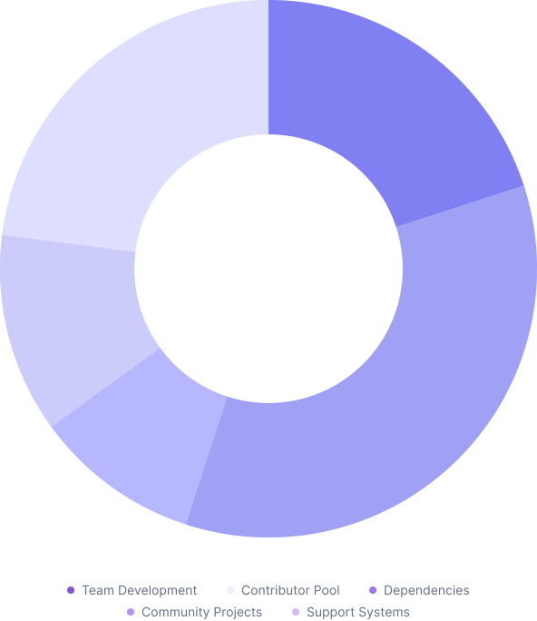

    

        

            <h1 class="section-title h2">Donate</h1>
            

                ESLint relies on donations for ongoing maintenance and development. There are currently 525 companies, organizations, and individuals donating $15,000 each month to help us out.
            

        

        

            carbon ad here
        

    

<section>
    

        

            <h2 class="section-title h3">Ways to donate</h2>
            

                Here’s how you can donate.
            

        

        

            <article class="donation-plan span-1-6">
                <header class="donation-plan__header divider">
                    
                    

                        <h3 class="donation-plan__platform-name">Open Collective</h3>
                        
Our most popular plan for small teams.

                    

                </header>
                <ul role="list" class="donation-plan__features divider">
                    <li>One-time and recurring donations</li>
                    <li>Pay by credit card, bank transfer, or PayPalSet up open source funds to donate to multiple projects</li>
                    <li>Available in most countries</li>
                    <li>Requires signing up for Open Collective</li>
                </ul>
                <footer class="donation-plan__footer">
                    <a href="https://opencollective.com/eslint" class="c-btn c-btn--primary c-btn--block">
                        <svg width="21" height="20" viewBox="0 0 21 20" aria-label="Open Collective">
                            <path fill-rule="evenodd" clip-rule="evenodd" d="M16.8759 9.97371C16.8759 11.2331 16.5103 12.4409 15.8828 13.4384L18.4441 16.0103C19.6984 14.3306 20.4825 12.2309 20.4825 9.9734C20.4825 7.7159 19.6981 5.61652 18.4441 3.93652L15.8828 6.5084C16.51 7.5059 16.8759 8.66059 16.8759 9.97309V9.97371Z" fill="currentColor" />
                            <path fill-rule="evenodd" clip-rule="evenodd" d="M10.501 16.3781C6.99883 16.3781 4.12414 13.4906 4.12414 9.97406C4.12414 6.4575 6.99914 3.57 10.501 3.57C11.8079 3.57 12.9573 3.9375 13.951 4.62L16.5123 2.04813C14.8395 0.7875 12.7488 0 10.501 0C5.01227 0 0.517578 4.46187 0.517578 10.0262C0.517578 15.5906 5.01227 20 10.501 20C12.801 20 14.8916 19.2125 16.5645 17.9531L14.0032 15.3813C13.0101 16.0112 11.8079 16.3787 10.501 16.3787V16.3781Z" fill="currentColor" />
                        </svg>
                        Contribute on Open Collective</a>
                </footer>
            </article>
            <article class="donation-plan span-7-12">
                <header class="donation-plan__header divider">
                    
                    

                        <h3 class="donation-plan__platform-name">Github Sponsors</h3>
                        
Advanced features and reporting.

                    

                </header>
                <ul role="list" class="donation-plan__features divider">
                    <li>One-time and recurring donations</li>
                    <li>Pay by credit card or use your existing billing relationship with GitHub (including invoicing)</li>
                    <li>Show a “sponsor” badge on your GitHub profile</li>
                    <li>Use your existing GitHub login</li>
                </ul>
                <footer class="donation-plan__footer">
                    <a href="https://github.com/sponsors/eslint" class="c-btn c-btn--primary c-btn--block">
                        <svg width="21" height="20" viewBox="0 0 21 20" aria-label="Github">
                            <path fill-rule="evenodd" clip-rule="evenodd" d="M10.2495 0C4.6123 0 0 4.6123 0 10.2495C0 14.7764 2.90404 18.62 7.00386 19.9866C7.51634 20.072 7.68716 19.7304 7.68716 19.4741C7.68716 19.2179 7.68716 18.62 7.68716 17.7659C4.86854 18.3638 4.27065 16.3993 4.27065 16.3993C3.84358 15.2035 3.16028 14.8618 3.16028 14.8618C2.13532 14.264 3.16028 14.264 3.16028 14.264C4.18523 14.3494 4.69771 15.2889 4.69771 15.2889C5.63725 16.8263 7.08927 16.3993 7.68716 16.143C7.77257 15.4597 8.02881 15.0327 8.37047 14.7764C6.06432 14.5202 3.67276 13.6661 3.67276 9.73707C3.67276 8.6267 4.09982 7.68716 4.69771 7.00386C4.69771 6.66221 4.27065 5.63725 4.86854 4.27065C4.86854 4.27065 5.72267 4.01441 7.68716 5.2956C8.54129 5.03936 9.39542 4.95395 10.2495 4.95395C11.1037 4.95395 11.9578 5.03936 12.8119 5.2956C14.7764 3.92899 15.6306 4.27065 15.6306 4.27065C16.2285 5.72267 15.8014 6.74762 15.716 7.00386C16.3993 7.68716 16.7409 8.6267 16.7409 9.73707C16.7409 13.6661 14.3494 14.5202 12.0432 14.7764C12.3849 15.1181 12.7265 15.716 12.7265 16.6555C12.7265 18.0221 12.7265 19.1325 12.7265 19.4741C12.7265 19.7304 12.8973 20.072 13.4098 19.9866C17.5096 18.62 20.4137 14.7764 20.4137 10.2495C20.4991 4.6123 15.8868 0 10.2495 0Z" fill="currentColor" />
                        </svg>
                        Contribute on Github</a>
                </footer>
            </article>
        

    

</section>

<section>
    

        

            <h2 class="section-title h3">How the money is used</h2>
            

                The ESLint project uses donated money to benefit the project and the ESLint community as a whole. In general, we spend money on these areas each month.
            

        

        

            

                <article class="feature">
                    <h3 class="feature__title">Team Development</h3>
                    
We pay our team members an hourly rate based on their seniority, currently $60 USD/hour for TSC members and Reviewers and $30 USD/hour for committers.

                </article>
                <article class="feature">
                    <h3 class="feature__title">Contributor Pool</h3>
                    
We set aside $1,500 USD each month to pay outside contributors who have made significant contributions to the project. Contributions include submitting code, writing documentation, answering questions in our Discord server, and more. This money is allocated each month by the TSC.

                </article>
                <article class="feature">
                    <h3 class="feature__title">Dependencies</h3>
                    
We set aside $1,000 USD each month to help support our dependencies. We believe that open source projects who are lucky enough to get funded have a responsibility to help support the smaller projects they rely on.

                </article>
                <article class="feature">
                    <h3 class="feature__title">Community Projects</h3>
                    
We set aside $1,000 USD each month to help support plugins, parsers, and other projects that are of benefit to the ESLint ecosystem as a whole. We believe the strength of the project is in its ecosystem and we want to ensure important projects remain well-maintained.

                </article>
                <article class="feature">
                    <h3 class="feature__title">Support Systems</h3>
                    
We used a small amount each month to pay for software the team uses to help manage the project, which includes things like Google Workspace and cloud storage.

                </article>
            

            

                
            

        

        <footer class="section-foot center-text">
            

                Additionally, from time to time we use the funds to pay contractors to work on things that are important to the project and where the team doesn’t have the time or expertise to complete the work on their own. For example, we recently hired a designer and developer to redesign this website. We ensure that we spend less than we take in each month so we can save for such projects.
            

        </footer>
    

</section>

<section>
    

        

            <h2 class="section-title h3" id="donation-tiers-label">Donation tiers</h2>
            

                While we accept donations of any size, we do have a tier system with different rewards at each level.
            

        

        <ol class="donation-tiers" aria-labelledby="donation-tiers-label" role="list">
            <li class="donation-tiers__item">
                <h3 class="donation-tiers__title">
                    Platinum Sponsor 
                    $2000+
                    per month
                </h3>
                

                    2 hours of support, highest logo placement on homepage and readme and everything in Gold tier.
                

                

                    <a href="#" class="c-btn c-btn--primary c-btn--block">
                        <svg role="img" aria-label="Open Collective" width="21" height="20" viewBox="0 0 21 20">
                            <path fill-rule="evenodd" clip-rule="evenodd" d="M16.8759 9.97371C16.8759 11.2331 16.5103 12.4409 15.8828 13.4384L18.4441 16.0103C19.6984 14.3306 20.4825 12.2309 20.4825 9.9734C20.4825 7.7159 19.6981 5.61652 18.4441 3.93652L15.8828 6.5084C16.51 7.5059 16.8759 8.66059 16.8759 9.97309V9.97371Z" fill="currentColor" />
                                <path fill-rule="evenodd" clip-rule="evenodd" d="M10.501 16.3781C6.99883 16.3781 4.12414 13.4906 4.12414 9.97406C4.12414 6.4575 6.99914 3.57 10.501 3.57C11.8079 3.57 12.9573 3.9375 13.951 4.62L16.5123 2.04813C14.8395 0.7875 12.7488 0 10.501 0C5.01227 0 0.517578 4.46187 0.517578 10.0262C0.517578 15.5906 5.01227 20 10.501 20C12.801 20 14.8916 19.2125 16.5645 17.9531L14.0032 15.3813C13.0101 16.0112 11.8079 16.3787 10.501 16.3787V16.3781Z" fill="currentColor" />
                            </svg>
                            Donate on Open Collective
                        </a>
                    <a href="#" class="c-btn c-btn--primary c-btn--block">
                            <svg role="img" aria-label="Github" width="21" height="20" viewBox="0 0 21 20" aria-label="Github">
                                <path fill-rule="evenodd" clip-rule="evenodd" d="M10.2495 0C4.6123 0 0 4.6123 0 10.2495C0 14.7764 2.90404 18.62 7.00386 19.9866C7.51634 20.072 7.68716 19.7304 7.68716 19.4741C7.68716 19.2179 7.68716 18.62 7.68716 17.7659C4.86854 18.3638 4.27065 16.3993 4.27065 16.3993C3.84358 15.2035 3.16028 14.8618 3.16028 14.8618C2.13532 14.264 3.16028 14.264 3.16028 14.264C4.18523 14.3494 4.69771 15.2889 4.69771 15.2889C5.63725 16.8263 7.08927 16.3993 7.68716 16.143C7.77257 15.4597 8.02881 15.0327 8.37047 14.7764C6.06432 14.5202 3.67276 13.6661 3.67276 9.73707C3.67276 8.6267 4.09982 7.68716 4.69771 7.00386C4.69771 6.66221 4.27065 5.63725 4.86854 4.27065C4.86854 4.27065 5.72267 4.01441 7.68716 5.2956C8.54129 5.03936 9.39542 4.95395 10.2495 4.95395C11.1037 4.95395 11.9578 5.03936 12.8119 5.2956C14.7764 3.92899 15.6306 4.27065 15.6306 4.27065C16.2285 5.72267 15.8014 6.74762 15.716 7.00386C16.3993 7.68716 16.7409 8.6267 16.7409 9.73707C16.7409 13.6661 14.3494 14.5202 12.0432 14.7764C12.3849 15.1181 12.7265 15.716 12.7265 16.6555C12.7265 18.0221 12.7265 19.1325 12.7265 19.4741C12.7265 19.7304 12.8973 20.072 13.4098 19.9866C17.5096 18.62 20.4137 14.7764 20.4137 10.2495C20.4991 4.6123 15.8868 0 10.2495 0Z" fill="currentColor" />
                            </svg>
                            Donate on Github
                        </a>
                

            </li>
            <li class="donation-tiers__item">
                <h3 class="donation-tiers__title">
                    Gold Sponsor 
                    $1000–1999
                    per month
                </h3>
                

                    Second highest logo placement on homepage and readme, a Thank you tweet from our Twitter account (20,000 followers) and a thank you blog post.
                

                

                    <a href="#" class="c-btn c-btn--primary c-btn--block">
                        <svg role="img" aria-label="Open Collective" width="21" height="20" viewBox="0 0 21 20">
                            <path fill-rule="evenodd" clip-rule="evenodd" d="M16.8759 9.97371C16.8759 11.2331 16.5103 12.4409 15.8828 13.4384L18.4441 16.0103C19.6984 14.3306 20.4825 12.2309 20.4825 9.9734C20.4825 7.7159 19.6981 5.61652 18.4441 3.93652L15.8828 6.5084C16.51 7.5059 16.8759 8.66059 16.8759 9.97309V9.97371Z" fill="currentColor" />
                                <path fill-rule="evenodd" clip-rule="evenodd" d="M10.501 16.3781C6.99883 16.3781 4.12414 13.4906 4.12414 9.97406C4.12414 6.4575 6.99914 3.57 10.501 3.57C11.8079 3.57 12.9573 3.9375 13.951 4.62L16.5123 2.04813C14.8395 0.7875 12.7488 0 10.501 0C5.01227 0 0.517578 4.46187 0.517578 10.0262C0.517578 15.5906 5.01227 20 10.501 20C12.801 20 14.8916 19.2125 16.5645 17.9531L14.0032 15.3813C13.0101 16.0112 11.8079 16.3787 10.501 16.3787V16.3781Z" fill="currentColor" />
                            </svg>
                            Donate on Open Collective
                        </a>
                        <a href="#" class="c-btn c-btn--primary c-btn--block">
                            <svg role="img" aria-label="Github" width="21" height="20" viewBox="0 0 21 20" aria-label="Github">
                                <path fill-rule="evenodd" clip-rule="evenodd" d="M10.2495 0C4.6123 0 0 4.6123 0 10.2495C0 14.7764 2.90404 18.62 7.00386 19.9866C7.51634 20.072 7.68716 19.7304 7.68716 19.4741C7.68716 19.2179 7.68716 18.62 7.68716 17.7659C4.86854 18.3638 4.27065 16.3993 4.27065 16.3993C3.84358 15.2035 3.16028 14.8618 3.16028 14.8618C2.13532 14.264 3.16028 14.264 3.16028 14.264C4.18523 14.3494 4.69771 15.2889 4.69771 15.2889C5.63725 16.8263 7.08927 16.3993 7.68716 16.143C7.77257 15.4597 8.02881 15.0327 8.37047 14.7764C6.06432 14.5202 3.67276 13.6661 3.67276 9.73707C3.67276 8.6267 4.09982 7.68716 4.69771 7.00386C4.69771 6.66221 4.27065 5.63725 4.86854 4.27065C4.86854 4.27065 5.72267 4.01441 7.68716 5.2956C8.54129 5.03936 9.39542 4.95395 10.2495 4.95395C11.1037 4.95395 11.9578 5.03936 12.8119 5.2956C14.7764 3.92899 15.6306 4.27065 15.6306 4.27065C16.2285 5.72267 15.8014 6.74762 15.716 7.00386C16.3993 7.68716 16.7409 8.6267 16.7409 9.73707C16.7409 13.6661 14.3494 14.5202 12.0432 14.7764C12.3849 15.1181 12.7265 15.716 12.7265 16.6555C12.7265 18.0221 12.7265 19.1325 12.7265 19.4741C12.7265 19.7304 12.8973 20.072 13.4098 19.9866C17.5096 18.62 20.4137 14.7764 20.4137 10.2495C20.4991 4.6123 15.8868 0 10.2495 0Z" fill="currentColor" />
                            </svg>
                            Donate on Github
                        </a>
                

            </li>
            <li class="donation-tiers__item">
                <h3 class="donation-tiers__title">
                    Silver Sponsor 
                    $500–999
                    per month
                </h3>
                

                    Third highest logo placement on homepage and readme.
                

                

                    <a href="#" class="c-btn c-btn--primary c-btn--block">
                        <svg role="img" aria-label="Open Collective" width="21" height="20" viewBox="0 0 21 20">
                            <path fill-rule="evenodd" clip-rule="evenodd" d="M16.8759 9.97371C16.8759 11.2331 16.5103 12.4409 15.8828 13.4384L18.4441 16.0103C19.6984 14.3306 20.4825 12.2309 20.4825 9.9734C20.4825 7.7159 19.6981 5.61652 18.4441 3.93652L15.8828 6.5084C16.51 7.5059 16.8759 8.66059 16.8759 9.97309V9.97371Z" fill="currentColor" />
                                <path fill-rule="evenodd" clip-rule="evenodd" d="M10.501 16.3781C6.99883 16.3781 4.12414 13.4906 4.12414 9.97406C4.12414 6.4575 6.99914 3.57 10.501 3.57C11.8079 3.57 12.9573 3.9375 13.951 4.62L16.5123 2.04813C14.8395 0.7875 12.7488 0 10.501 0C5.01227 0 0.517578 4.46187 0.517578 10.0262C0.517578 15.5906 5.01227 20 10.501 20C12.801 20 14.8916 19.2125 16.5645 17.9531L14.0032 15.3813C13.0101 16.0112 11.8079 16.3787 10.501 16.3787V16.3781Z" fill="currentColor" />
                            </svg>
                            Donate on Open Collective
                        </a>
                        <a href="#" class="c-btn c-btn--primary c-btn--block">
                            <svg role="img" aria-label="Github" width="21" height="20" viewBox="0 0 21 20" aria-label="Github">
                                <path fill-rule="evenodd" clip-rule="evenodd" d="M10.2495 0C4.6123 0 0 4.6123 0 10.2495C0 14.7764 2.90404 18.62 7.00386 19.9866C7.51634 20.072 7.68716 19.7304 7.68716 19.4741C7.68716 19.2179 7.68716 18.62 7.68716 17.7659C4.86854 18.3638 4.27065 16.3993 4.27065 16.3993C3.84358 15.2035 3.16028 14.8618 3.16028 14.8618C2.13532 14.264 3.16028 14.264 3.16028 14.264C4.18523 14.3494 4.69771 15.2889 4.69771 15.2889C5.63725 16.8263 7.08927 16.3993 7.68716 16.143C7.77257 15.4597 8.02881 15.0327 8.37047 14.7764C6.06432 14.5202 3.67276 13.6661 3.67276 9.73707C3.67276 8.6267 4.09982 7.68716 4.69771 7.00386C4.69771 6.66221 4.27065 5.63725 4.86854 4.27065C4.86854 4.27065 5.72267 4.01441 7.68716 5.2956C8.54129 5.03936 9.39542 4.95395 10.2495 4.95395C11.1037 4.95395 11.9578 5.03936 12.8119 5.2956C14.7764 3.92899 15.6306 4.27065 15.6306 4.27065C16.2285 5.72267 15.8014 6.74762 15.716 7.00386C16.3993 7.68716 16.7409 8.6267 16.7409 9.73707C16.7409 13.6661 14.3494 14.5202 12.0432 14.7764C12.3849 15.1181 12.7265 15.716 12.7265 16.6555C12.7265 18.0221 12.7265 19.1325 12.7265 19.4741C12.7265 19.7304 12.8973 20.072 13.4098 19.9866C17.5096 18.62 20.4137 14.7764 20.4137 10.2495C20.4991 4.6123 15.8868 0 10.2495 0Z" fill="currentColor" />
                            </svg>
                            Donate on Github
                        </a>
                

            </li>
            <li class="donation-tiers__item">
                <h3 class="donation-tiers__title">
                    Bronze Sponsor 
                    $200–499
                    per month
                </h3>
                

                    Fourth highest logo placement on homepage and readme.
                

                

                    <a href="#" class="c-btn c-btn--primary c-btn--block">
                        <svg role="img" aria-label="Open Collective" width="21" height="20" viewBox="0 0 21 20">
                            <path fill-rule="evenodd" clip-rule="evenodd" d="M16.8759 9.97371C16.8759 11.2331 16.5103 12.4409 15.8828 13.4384L18.4441 16.0103C19.6984 14.3306 20.4825 12.2309 20.4825 9.9734C20.4825 7.7159 19.6981 5.61652 18.4441 3.93652L15.8828 6.5084C16.51 7.5059 16.8759 8.66059 16.8759 9.97309V9.97371Z" fill="currentColor" />
                                <path fill-rule="evenodd" clip-rule="evenodd" d="M10.501 16.3781C6.99883 16.3781 4.12414 13.4906 4.12414 9.97406C4.12414 6.4575 6.99914 3.57 10.501 3.57C11.8079 3.57 12.9573 3.9375 13.951 4.62L16.5123 2.04813C14.8395 0.7875 12.7488 0 10.501 0C5.01227 0 0.517578 4.46187 0.517578 10.0262C0.517578 15.5906 5.01227 20 10.501 20C12.801 20 14.8916 19.2125 16.5645 17.9531L14.0032 15.3813C13.0101 16.0112 11.8079 16.3787 10.501 16.3787V16.3781Z" fill="currentColor" />
                            </svg>
                            Donate on Open Collective
                        </a>
                        <a href="#" class="c-btn c-btn--primary c-btn--block">
                            <svg role="img" aria-label="Github" width="21" height="20" viewBox="0 0 21 20" aria-label="Github">
                                <path fill-rule="evenodd" clip-rule="evenodd" d="M10.2495 0C4.6123 0 0 4.6123 0 10.2495C0 14.7764 2.90404 18.62 7.00386 19.9866C7.51634 20.072 7.68716 19.7304 7.68716 19.4741C7.68716 19.2179 7.68716 18.62 7.68716 17.7659C4.86854 18.3638 4.27065 16.3993 4.27065 16.3993C3.84358 15.2035 3.16028 14.8618 3.16028 14.8618C2.13532 14.264 3.16028 14.264 3.16028 14.264C4.18523 14.3494 4.69771 15.2889 4.69771 15.2889C5.63725 16.8263 7.08927 16.3993 7.68716 16.143C7.77257 15.4597 8.02881 15.0327 8.37047 14.7764C6.06432 14.5202 3.67276 13.6661 3.67276 9.73707C3.67276 8.6267 4.09982 7.68716 4.69771 7.00386C4.69771 6.66221 4.27065 5.63725 4.86854 4.27065C4.86854 4.27065 5.72267 4.01441 7.68716 5.2956C8.54129 5.03936 9.39542 4.95395 10.2495 4.95395C11.1037 4.95395 11.9578 5.03936 12.8119 5.2956C14.7764 3.92899 15.6306 4.27065 15.6306 4.27065C16.2285 5.72267 15.8014 6.74762 15.716 7.00386C16.3993 7.68716 16.7409 8.6267 16.7409 9.73707C16.7409 13.6661 14.3494 14.5202 12.0432 14.7764C12.3849 15.1181 12.7265 15.716 12.7265 16.6555C12.7265 18.0221 12.7265 19.1325 12.7265 19.4741C12.7265 19.7304 12.8973 20.072 13.4098 19.9866C17.5096 18.62 20.4137 14.7764 20.4137 10.2495C20.4991 4.6123 15.8868 0 10.2495 0Z" fill="currentColor" />
                            </svg>
                            Donate on Github
                        </a>
                

            </li>
        </ol>
    

</section>

<section>
    

        

            <h2 class="section-title h3" hidden>Testimonials</h2>
        

    

                



                        <blockquote class="c-slider__testimonial span-1-6">
                            

                                

                                    {{ item.text }}
                                

                            

                            <footer class="c-slider__testimonial__footer">
                                <cite class="person contributor">
                                    
                                    

                                        {{ item.name }}
                                        {{ item.title }}
                                    

                                </cite>
                            </footer>
                        </blockquote>
                    


 

</section>



